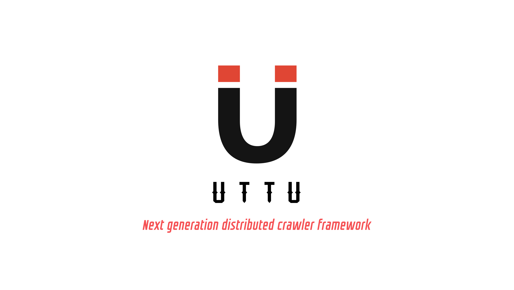

<div align=center>

<a href="https://github.com/Leon1s97/Uttu/">

</a>

# :sparkles: uttu :sparkles:

<b><i>Next generation distributed crawler framework</i></b>

<hr />

<!-- Introduction -->
# :purple_heart: Introduction

A Powerful Distributed Crawler Framework Developed by Python.

- Write script in Python
- Powerful WebUI with script editor, task monitor, project manager and result viewer
- MongoDB, Redis, SQLite, Microsoft SQL Server, PostgreSQL as database backend
- RabbitMQ, Redis and Kafka as message queue
- Task priority, retry, periodical, recrawl by age, etc...
- Distributed architecture, Crawl Javascript pages, Python3+ support, etc...

Tutorial: https://github.com/Leon1s97/Uttu/
Documentation: https://github.com/Leon1s97/Uttu/
Release notes: https://github.com/Leon1s97/Uttu/releases

<hr />

# :blue_heart: Why Uttu


<hr />

# :heart: QuickStart 

### :star2: Installation
```bash
$ python -m pip install uttu
```


### :star2: Directory description:
```
├─ docs
├─ tests
├─ uttu
│  ├─ commands
│  ├─ spiders
│  ├─ templetes
│  ├─ watcher
│  ├─ worker
│  ├─ __init__.py
│  ├─ exceptions.py
│  └─ requirements.txt
├─ LICENSE
├─ .gitignore
├─ MANIFEST.in
├─ README.md
├─ setup.py
```


### :star2: Usage

```bash
python3 -m venv <venv-path>
cd <venv-path>
uttu startproject <projectname>
```

<hr />

# :green_heart: Maintainers


- [Leon1s](https://github.com/Leon1s97)
[](https://github.com/anuraghazra/github-readme-stats)

Thanks for all your wonderful PRs, issues and ideas. 
<hr />

# :yellow_heart: License 

[MIT](https://opensource.org/licenses/MIT)

</div>